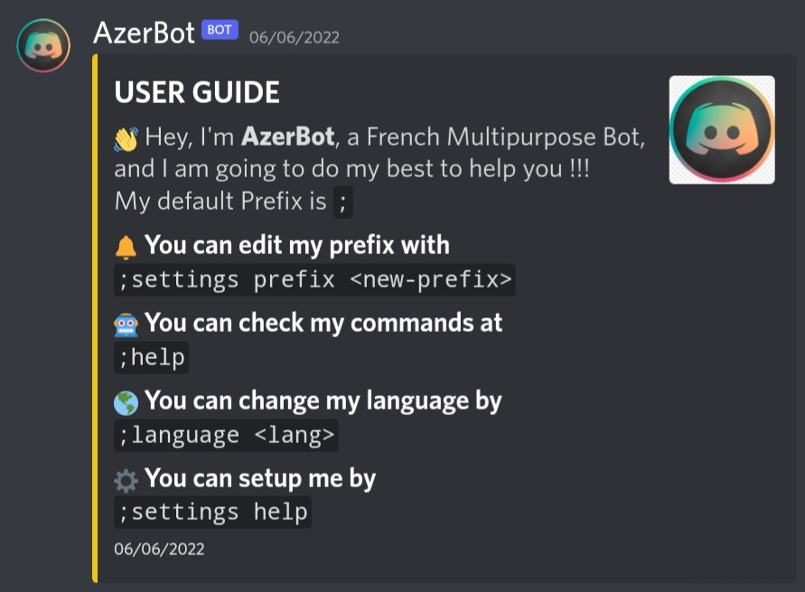

<!-- Logo -->

  

<!-- Title -->
<h1 align="center">AzerBot 1.1.8</h1>
  

     
  

</h1>

  

## Main Links

- Commands
- Changelog

## Prefix

The default prefix is `;`, you can change it with `;settings prefix <new-prefix>`
 

## ✨ Features

- Defaults
- Moderation
- Utility
- Fun

## 🛠 Invite Link

https://discord.com/api/oauth2/authorize?client_id=782885398316711966&permissions=8&scope=bot%20applications.commands
 

## Supported Languages:

- English
- French

## License

Copyright CC-by-nc | ©2022 AZERTY. All rights Reserved | AZERTY#9999

Distributed under the GNU General Public License v3.0. See `LICENSE` for more information.
